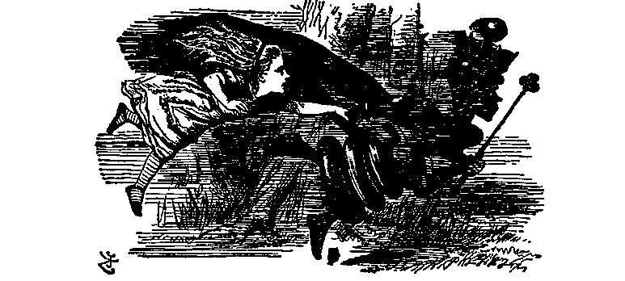
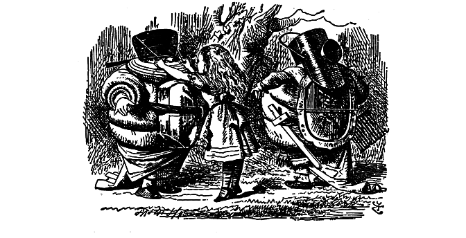
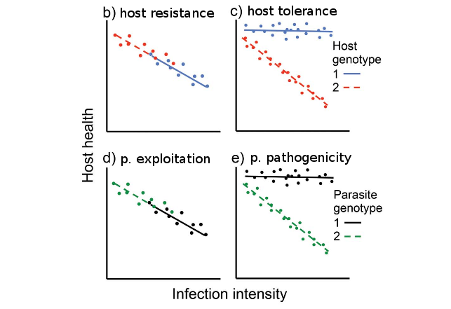
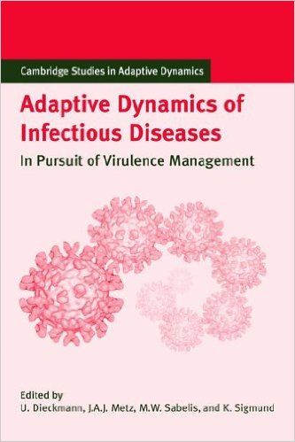

<!-- 
apa.csl is a slightly hacked version of APA 
  (modified for "et al" after 2 authors in text)
-->
<!-- .refs is style for reference page (small text) -->
<style>
.refs {
    font-size: 12px;
    columns: 2 200px;         /* number of columns and width in pixels*/
    -webkit-columns: 2 200px; /* chrome, safari */
    -moz-columns: 2 200px;    /* firefox */
}
.sm_block {
   font-size: 20px;
}
h2 { 
 color: #3399ff;		
}
h3 { 
 color: #3399ff;		
}
.title-slide {
   background-color: #55bbff;
}
</style>
<!--    content: url(https://i.creativecommons.org/l/by-sa/4.0/88x31.png)
>
<!-- Limit image width and height -->
<style type="text/css">
img {     
  max-height: 560px;     
  max-width: 500px; 
}
div#before-column p.forceBreak {
	break-before: column;
}

div#after-column p.forceBreak {
	break-after: column;
}
p {
    break-inside: avoid-column;
}
</style>

```{r setup,echo=FALSE,message=FALSE}
library("ggplot2"); theme_set(theme_classic())
library("reshape2")
library("ggExtra")
library("MASS")
library("knitr")
library("pander")
opts_chunk$set(echo=FALSE,fig.width=4,fig.height=4)
```

# parasite<br>ecology & evolution

## why study parasite eco/evo? 

- cool natural history
- drives ecological communities  
(e.g. Janzen-Connell, apparent competition)
- interesting ecological systems
- conservation/  
wildlife management/  
agricultural impact
- human health

## what is a parasite? {.columns-2}

- *natural enemy - victim* interaction
(parasite gains, host loses)

- + close association (*symbiosis*)
- + doesn't kill host   
(prolonged interaction)

<p forceBreak></p>
```{r echo=FALSE,results="asis"}
d <- matrix(c("predator","grazer",
              "parasitoid","parasite"),
            byrow=TRUE,nrow=2,
            dimnames=list(c("non-symbiotic","symbiotic"),
                          c("kills host","doesn't kill host")))
pander(d)
```

## enemy-victim interactions

- mix of positive and negative feedback
- interesting dynamics
    - ecology: cycles
	- (co)evolution: *Red Queen* cycles

## chasing the Red Queen:<br>recognition and evasion {.columns-2}

<p>
- maintenance of sex  
[@EbertHamilton1996]
- clonal replacement
(Lively)
- sexual selection:
    - ornamentation: Hamilton-Zuk
	- immunocompetence handicap: Folstad
     - MHC-based selection: Penn and Potts
</p>

<p class="forceBreak"></p>



-

## from Red Queen to arms races {.columns-2}

<p>
- changing metaphors
- variable recognition
(e.g. antibodies)
- conserved *effectors*
(e.g. apoptosis, killer cells, melanization ...)
- suppose *recognition* is unavoidable
- choice is in *strength* of effector response
</p>



# evolution of virulence

## historical stages

- "classical dogma"
- Ewald era: verbal tradeoff theory
- post-Ewald: mathematical tradeoff theory
- modern: diversity of concerns

## defining virulence

- harm to host (= loss of host fitness)
- ... in a **reference** host  
(*warning*: host $\times$ parasite interaction?)
- special cases [@day_evolution_2002]
    - case mortality
	- loss of fecundity (castration)
	- debilitation
	- disease-induced mortality **rate**
- alternate definition in plant epidemiology

## physiology of virulence

- **why** are parasites virulent, and what connects virulence to between-host dynamics?
- replication rate/efficiency $\to$ parasite load
- faster use of host resources (cells/nutrients)
- immunopathology: virulence connection with **clearance**

## resistance, and tolerance {.columns-2}

<p>
- **resistance**: avoid infection or reduce load
- **tolerance**: reduce fitness cost per unit load
- qualitatively different evolutionary dynamics [@RoyKirchner2000]
- 4-way interaction:
(resistance $\times$ tolerance $\times$ exploitation $\times$ pathogenicity)
</p>



(after @raberg_how_2014)

## classical dogma [@LevinSvanborgEden1990]

- parasites evolve to minimize virulence
- over evolutionary time, become *commensal*
- naively group selectionist
- anecdotal: sampling bias?
    - syphilis [@Knell2004]
	- myxomatosis [@Dwyer+1990]
	- virgin-soil epidemics

## Paul Ewald {.columns-2}

- popularized idea of *virulence management*
- environmental vs direct  
(e.g. cholera)
- horizontal vs vertical  
(e.g. needle/sex vs maternal)
- effect of transmission rate
(e.g. 1918 flu)
- mostly correlative

<p class="forceBreak"></p>


## modes of transmission

- does virulence favor or disfavor transmission?
   - vertical vs horizontal
   e.g. lytic vs non-lytic phage, sigma virus
   - active
       - e.g. rabies; aerosol spread by sneezing
   - necro-transmission (anthrax) [@day_virulence_2002]
   - trophic
   - vector
   - iatrogenic/nosocomial
- generally hard to manipulate

## post-Ewald {.columns-2}

- **tradeoff theory**
- from verbal to mathematical theory
- e.g. *adaptive dynamics*



## tradeoff theory

- individual, not population, as unit of selection
- assumed *tradeoff curve*
- virulence = rate of host mortality
- transmission *rate* increases with virulence ...
- but with diminishing returns

## the tradeoff curve {.columns-2}

```{r tradeoff}
par(cex=1.5,lwd=2,bty="l",yaxs="i",las=1,mgp=c(2,0.5,0),
    mar=c(3,3,1,1))
tmpf <- function(c=5,gamma=1/3) {
    curve(c*(pmax(0,x))^gamma,from=-2,to=5,axes=FALSE,
          xlab="            Clearance+disease-induced mort.",ylab="",
          xaxs="i",yaxs="i")
    abline(v=0)
    rect(-1,7,1,10,col="white",border=NA)
    text("transmission\nrate",x=0,y=8,xpd=NA)
    axis(side=1,at=c(-2,0:5),labels=c("",0:5))
    mtext(side=1,at=-2,line=par("mgp")[2],expression(mu),cex=1.5)
}
tmpf()
Rcol <- "blue"
rcol <- "red"
abline(a=2,b=1,col=Rcol)
## what is the optimal slope here?
abline(a=2*4/3,b=4/3,col=Rcol)
abline(a=2*5/3,b=5/3,col=Rcol)
```

$$
\begin{split}
{\mathcal R}_0 & = \frac{\beta(\alpha) N}{\mu+\alpha} \\
\beta'(\alpha) & = \frac{\beta(\alpha)}{\mu+\alpha}
\end{split}
$$

## other assumptions of tradeoff theory

- host as homogeneous "bags of resources"; no evolution
- no host heterogeneity
- one parasite lineage per host
    - no superinfection or coinfection
	- no within-host mutation
	- no within-host conflict
- fixed host population size

```{r all_tradeoff_curvs,warning=FALSE}
## <<jensendat,echo=FALSE,warning=FALSE>>=
jensendat = read.table("data/jensen-fig.dat")
names(jensendat) =c("Days","Spores")
jensendat$Days = round(jensendat$Days)
jensendat$Spores = pmax(0,jensendat$Spores)
g1 = glm(Spores~poly(Days,2),family=quasipoisson,data=jensendat)
newdays = seq(min(jensendat$Days),max(jensendat$Days),length.out=100)
vals = predict(g1,newdata=data.frame(Days=newdays),type="response")
##plot(jensendat$Days,jensendat$Spores)
##lines(newdays,vals)
g0 = glm(Spores~Days,family=quasipoisson,data=jensendat)
## anova(g0,g1,test="F")
newdays2 = 1/seq(0.001,0.05,length=100)
vals2 = predict(g1,newdata=data.frame(Days=newdays2),type="response",
  se.fit=TRUE)
## mean longevity APPROX 130 days
meanmu = 1/130
newalpha1 = (1/jensendat$Days)/meanmu
## <<hivdat,cache,warning=FALSE,message=FALSE>>=
## duration, taken from Fraser et al 2007 fig 1
d <- read.table("data/fraser-VL.dat",header=TRUE)
library(plotrix)
## with(d,plotCI(10^logVL,meanval,ui=upper,li=lower,pch=16,
##               log="x"))
f <- read.csv("data/fraser-TP.csv")
## with(f,plotCI(VL,TP_Best,uiw=CI.upper,liw=CI.lower,pch=16,
##              log="x"))
dsp <- with(d,splines::interpSpline(logVL,meanval))
durvals <- predict(dsp,x=f$Log.Viral.Load)$y
d3 <- data.frame(duration=durvals,svir=70/durvals,
                 tp=f$TP_Best,
                 tp.lo=f$TP_bot,tp.hi=f$TP_top,
                 trate=f$TP_Best/durvals,
                 trate.lo=f$TP_bot/durvals,
                 trate.hi=f$TP_top/durvals)
d3 <- subset(d3,duration>0)
dutch.mean <- 4.36  ## mean log10(VL) for Amsterdam
zambia.mean <- 4.74 ## ditto for Zambia
optR0 <- 4.52 ## 
optr <- 4.83
mvals <- predict(dsp,x=c(dutch.mean,zambia.mean,optR0,optr))
## <<echo=FALSE,warning=FALSE>>=
## from Table 5 of MacKinnon and Read 1999:
t5 = data.frame(
  maxparas=        c(19.3,19.2 ,23.3, 8.4 ,27.5 ,27.6 , 8.6 ,24.0 ,NA),
  maxparas_day=    c(10.4, 9.4 , 9.7,10.2 , 8.8 , 9.9 ,10.2 , 9.5 ,NA),
  minwt =          c(19.2,17.8 ,19.6,19.5 ,16.9 ,16.9 ,19.4 ,16.8 ,20.1),
  minwt_day =      c(10.9,10.9 ,11.0,10.3 ,10.0 ,10.9 ,10.8 ,11.3 ,NA),
  minrbcdens =     c(1.68, 0.98,1.19, 2.79, 0.77, 1.03, 2.07, 0.78,10.53),
  minrbcdens_day = c(11.7,10.8 ,10.8,11.5 ,10.01,11.1 ,11.3 ,12.0 ,NA),
  paras_maxgam =   c(1.6 , 1.0 , 2.2, 0.5 , 0.9 , 1.6 , 0.6 , 2.9 ,NA),
  maxgam =         c(0.4 , 0.14,1.17, 0.23, 0.29, 0.26, 0.18, 0.81,NA),
  maxgam_day =     c(13.5,14.4 ,13.2,13.8 ,14.7 ,13.1 ,13.2 ,13.9 ,NA),
  totgam =         c(2.31, 0.84,9.52, 1.85, 3.21, 1.94, 1.48,13.96,NA),
  inf_all =        c(22.2,12.6 ,29.2, 5.4 ,18.0 ,18.4 , 7.5 ,24.6 ,NA),
  inf_rep3 =       c(18.6,24.8 ,58.7,13.6 ,46   ,15.1 ,10.2 , 4.1 ,NA),
  inf_rep4 =       c(25.7, 1.1 ,12.3, 0.0 , 6.4 ,55.2 , 2.6 ,39.6 ,NA))
rownames(t5)= c("AD","AJ","AQ","AS","AT","BC","CW","HR","Control")
t5A = t5[-nrow(t5),c(1,3,5,7,8,10,11)]
##round(cor(t5A),2)
q1 = lm(inf_all~poly(maxparas,2),data=t5A)
L1 = lm(inf_all~maxparas,data=t5A)
## with(t5A,plot(minrbcdens,totgam))
## with(t5A,plot(-minwt,inf_all))
newp = seq(0,30,length=100)
ipred = predict(q1,newdata=data.frame(maxparas=newp))
## anova(L1,q1) 
## <<pauldat,echo=FALSE,warning=FALSE>>=
pauldat = read.table("data/paul1.csv",sep=",",header=TRUE)
alpha = 1/as.numeric(levels(pauldat$day)[pauldat$day])
alpha = alpha*(8*365)  ## multiply by host lifespan
alpha[is.na(alpha)] <- 0
## pch 1  (circle) SL
## pch 3  (cross) 4+4
## pch 15 (square) Thai
## pch 17 (triangle) 8+8
pchs=c("4+4"=3,"8+8"=17,"SL"=1,"Thai"=15)
## replicate Paul et al figure
## with(pauldat,
## plot(as.numeric(day),pct,pch=pchs[treat],ylim=c(0,100),
##      axes=FALSE)
## axis(side=2)
##axis(side=1,at=1:5,labels=levels(x$day))
```

## tradeoff curves

- rarely measured

## malaria

```{r fig.width=10}
par(mfrow=c(1,2))
par(cex=1.5,lwd=2,bty="l",yaxs="i",las=1,mgp=c(2.5,1,0),
    mar=c(4,4,1,1),font.main=1.5)
## par(bty="l",las=1)
## Paul et al:
with(pauldat,plot(alpha,pct.inf,pch=pchs[treat],ylim=c(0,100),
     ylab="% mosquitoes infected",xlab="Scaled virulence"))
title(main=list("Plasmodium gallinaceum",font=4))
## corner.label("c",cex=1.5)
jlfit = lm(pct.inf~alpha,data=pauldat)
jqfit = lm(pct.inf~poly(alpha,2),data=pauldat)
avec = seq(0,1500,length=200)
lines(avec,predict(jqfit,newdat=list(alpha=avec)),lty=1)
legend("bottomleft",
       pch=pchs,
       c("low-dose mixed","high-dose mixed",
         "SL","Thai"),bty="n",cex=0.8)
##
with(t5A,plot(maxparas,inf_all,
              xlab="Maximum parasitemia",
              ylab="Overall infection (%)"))
title(main=list("Plasmodium chabaudi",font=4))
## corner.label("d",cex=1.5)
lines(newp,ipred)
abline(L1,lty=2)
```

- @MackinnonRead1999a, @Paul+2004
- transmission (y-axis) in percent infection
- often using virulence *proxies*: anemia

## *Pasteuria ramosa* {.columns-2}

- @Jensen+2006
- *castrating* parasite   
(so "host fitness" is decoupled)

```{r jensenfig}
## par(las=1)
par(cex=1.5,lwd=2,bty="l",yaxs="i",las=1,mgp=c(2,0.5,0),
    mar=c(4,4,1,1))
with(jensendat,plot(newalpha1,Spores/Days,xlim=c(0,max(newalpha1)),
      xlab="Scaled virulence",ylab="",xpd=NA))
mtext(side=2,line=2.8,expression(paste("Spores/day ",({}%*%10^6))),
      las=0,cex=1.5)
newalpha=(1/newdays2)/meanmu
polygon(c(newalpha,rev(newalpha)),
        c((vals2$fit-2*vals2$se.fit)/newdays2,rev((vals2$fit+2*vals2$se.fit)/newdays2)),
        ## col=rgb(0.5,0.5,0.5,0.5),
        col="gray",
        border=NA)
with(jensendat,points(newalpha1,Spores/Days))
lines(newalpha,vals2$fit/newdays2)
```

 
## HIV
```{r hivfig,fig.width=6,fig.height=6}
par(mar=c(5,4,3,1),cex=1.5,lwd=1.5,las=1,bty="l",
    mgp=c(2.75,1,0))
with(d3,plot(svir,trate,xlim=c(0,60),type="l",
             ylab="Transmission rate",
             xlab="Scaled virulence",
             ylim=c(0,0.5)))

     ## ,ylim=c(0,2.5)))
with(d3,polygon(c(svir,rev(svir)),
                c(trate.lo,rev(trate.hi)),
                ## col=rgb(0.5,0.5,0.5,0.5),
                col="gray",
  border=NA))
with(d3,lines(svir,trate))
par(xpd=NA)
par(cex.main=1)
par(xpd=FALSE)
vvals <- 70/mvals$y[3:4]
##vvals[1] <- vvals[1]+3
abline(v=vvals,lty=c(1,3))
u2 <- 0 ## par("usr")[3]
text(vvals+c(3,0),rep(u2,2),pos=c(2,4),
     c("eq","epi"),
     xpd=NA)
```

[@Fraser+2007]
 
## applications

- effects of imperfect vaccines [@AndreGandon2006]
- effects of long-lasting stages [@bonhoeffer_curse_1996;@gandon_curse_1998;@kamo_curse_2004]

## the modern era

- recognition of complexity
- backlash against simple tradeoff models [@EbertBull2003;@alizon_adaptive_2015]
- more within-host dynamics [@king_evolution_2009;@AlizonvanBaalen2005;@GilchristCoombs2006]
- Price equation [@DayProulx2004a]
- host factors

## complexities

- tradeoff curve may vary sensitively with within-host parameters
- interplay with other factors
    - host/parasite life history
	- seasonal variation
	- host heterogeneity
	- presence of resting stages
    - spatial (connections to game theory)

## short-sighted evolution/<br>accidental virulence

- dead-end hosts
(West Nile)
- spillover hosts
(bubonic plague)
- dead-end tissues  
*Neisseria meningitides* (neuropathy generally)

## within-host dynamics

- within-host competition typically (?) increases virulence
- breakdown of "prudent" solutions
- increase in exploitation rate?
- but ... depends on details (again):
    - may be mediated through host interactions
	- may depend on details

## spatial structure

- theory: spatial structure should select for decreased virulence
- experiment: viscosity decreases *infectivity* in meal moths [@BootsMealor2007]
- tradeoffs between virulence and movement will *lower* virulence near the edge of the wave [@osnas_evolution_2015]

## demography

- decreasing population sizes *may* select for lower virulence [@LenskiMay1994]
- bottlenecks in parasite transmission [@BergstromMcElhany+1999]
- effects of epidemic fade-out ("invasion-persistence tradeoff") [@king_evolution_2009]

# outlook and challenges

## parameter estimation

- where do parameters come from?
    - order-of-magnitude estimates from natural history
	- ranges plus Latin hypercube sampling
	- direct measurement
	- estimation from time series

## model structure

- parasites
    - "game theoretic" (maximize ${\mathcal R}_0$)
	- adaptive-dynamic (invasibility diagrams)
    - 2-strain (or few-strain), explicit dynamics
    - Price equation/quantitative genetic (fixed variance)
    - many-strain (partial differential equation)
    - agent-based
- epidemic structure:
    - SI(R)(S)	?
	- frequency- or density-dependent?
	- vector-borne?
- hosts
    - tolerance/resistance genetics?   
(same choices as above, plus Mendelian options ...)	
	- demography?
	- density-dependence?
	- heterogeneity?
	- population structure (spatial, age, etc.)?
	- multi-host community?
	
## where do we go from here?

- alternative approaches?
     - phylogenetic
	 - bioinformatic
	 - population genetic
- how do we get phenotypes?
- tie cellular/molecular processes to population level?
- is there a general theory? should there be?

## example

## references {.refs}

